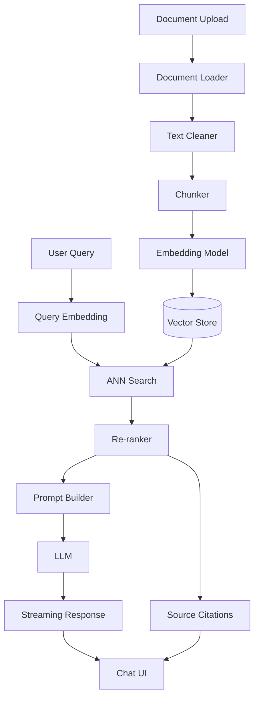

<div dir="rtl">

# בניית מערכת RAG Production-Grade עם Next.js

**מדריך מלא מקצה לקצה**

---

## תוכן עניינים

1. [מבוא](#1-מבוא)
2. [ארכיטקטורה](#2-ארכיטקטורה)
3. [הגדרת הפרויקט](#3-הגדרת-הפרויקט)
4. [הכנת המסמכים](#4-הכנת-המסמכים)
5. [יצירת Embeddings](#5-יצירת-embeddings)
6. [Vector Store](#6-vector-store)
7. [Retrieval Pipeline](#7-retrieval-pipeline)
8. [Generation Layer](#8-generation-layer)
9. [Next.js API Routes](#9-nextjs-api-routes)
10. [ממשק משתמש](#10-ממשק-משתמש)
11. [אופטימיזציה ו-Production Readiness](#11-אופטימיזציה-ו-production-readiness)
12. [טסטים](#12-טסטים)
13. [דפלוימנט](#13-דפלוימנט)

---

## 1. מבוא

### מה זה RAG ולמה זה חשוב

RAG — Retrieval-Augmented Generation — הוא תבנית ארכיטקטורית שמשלבת חיפוש סמנטי עם יכולות הגנרציה של מודלי שפה גדולים. במקום להסתמך על הידע שנאפה לתוך המשקלים של המודל בזמן אימון, RAG מאפשר למודל לגשת למידע עדכני, ספציפי לדומיין, ומבוקר — בזמן אמת.

הבעיה שRAG פותר היא ריאלית: LLMs הם חזקים מאוד אבל ה"ידע" שלהם קפוא בנקודת זמן מסוימת, הם הולוצינטים בהצגת פרטים ספציפיים, ואי אפשר להזין להם את כל ה-codebase, הדוקומנטציה או בסיס הידע הארגוני שלך בתוך ה-context window.

RAG פותר את זה בשלושה שלבים עיקריים:

1. **אינדוקס** — פיצול המסמכים, הפיכתם לוקטורים ואחסונם
2. **רטריבל** — מציאת הקטעים הרלוונטיים ביותר לשאלה
3. **גנרציה** — הזנת הקונטקסט הרלוונטי לMLLM ייצור תשובה מבוססת

### למה Next.js

Next.js 14+ עם App Router הוא פלטפורמה אידיאלית לבניית מערכות RAG production-grade מכמה סיבות:

- **Route Handlers** תומכים ב-streaming responses out of the box — קריטי לחווית UX של chat
- **Edge Runtime** מאפשר latency נמוך לroutes שאינם CPU-heavy
- **Server Components** מאפשרים data fetching בצד שרת בלי לחשוף API keys
- **Vercel AI SDK** נכתב במיוחד עבור Next.js ומספק abstractions מצוינות עבור streaming LLM
- **TypeScript first** — הסוגים שמגיעים עם Vercel AI SDK, Pinecone client ו-OpenAI client הם מעולים

### מה נבנה

לאורך המדריך נבנה מערכת **"DocuChat"** — צ'אטבוט ארגוני שמאפשר לעובדים לשאול שאלות בשפה טבעית על בסיס ידע פנים-ארגוני (PDFs, מסמכי Markdown, wiki pages).

**Feature set:**
- העלאת מסמכים ועיבודם לאינדקס
- צ'אט עם streaming תשובות
- הצגת מקורות עם קישורים לקטעים הרלוונטיים
- מטא-דאטה filtering (לפי מחלקה, תאריך, סוג מסמך)
- Rate limiting ו-caching
- Observability מלאה עם tracing

---

## 2. ארכיטקטורה

### תרשים רכיבים כללי

</div>

```
┌─────────────────────────────────────────────────────────────┐
│                      INGESTION PIPELINE                      │
│                                                             │
│  Documents   →   Loader   →   Chunker   →   Embedder       │
│  (PDF/MD/    │   (parse    │  (split     │  (OpenAI /       │
│   HTML)      │   + clean)  │   + overlap)│   Cohere)        │
│              │             │             │        │         │
└──────────────┴─────────────┴─────────────┴────────┼─────────┘
                                                     │
                                                     ▼
                                            ┌────────────────┐
                                            │  Vector Store  │
                                            │  (Pinecone /   │
                                            │   pgvector /   │
                                            │   Qdrant)      │
                                            └───────┬────────┘
                                                    │
┌───────────────────────────────────────────────────▼──────────┐
│                       QUERY PIPELINE                          │
│                                                              │
│  User Query  →  Embed Query  →  Similarity  →  Re-rank  →   │
│                               Search (ANN)   (Cohere /       │
│                                              Cross-enc.)     │
│                                                    │         │
│                                                    ▼         │
│                                             Prompt Builder   │
│                                             (context inject) │
│                                                    │         │
│                                                    ▼         │
│                                             LLM (GPT-4o /   │
│                                              Claude / etc.)  │
│                                                    │         │
│                                                    ▼         │
│                                         Streaming Response   │
│                                         + Source Citations  │
└──────────────────────────────────────────────────────────────┘
```

<div dir="rtl">

### תרשים Mermaid לflow המלא

</div>



<div dir="rtl">

### שכבות הסיסטם

**Ingestion Layer** — רץ offline (או triggered), אחראי על עיבוד ואינדוקס מסמכים.

**Query Layer** — רץ real-time, מקבל שאלה ומחזיר תשובה. זה ה-critical path מבחינת latency.

**Storage Layer** — Vector store + relational DB (metadata) + cache.

**Application Layer** — Next.js app עם Route Handlers וReact UI.

> 💡 **טיפ:** הפרד בין ingestion לquery pipelines מתחילת הדרך. Ingestion יכול לקחת שניות עד דקות ואין סיבה שהמשתמש יחכה לו בזמן אמת.

---

## 3. הגדרת הפרויקט

### יצירת הפרויקט

</div>

```bash
npx create-next-app@latest docuchat \
  --typescript \
  --tailwind \
  --app \
  --src-dir \
  --import-alias "@/*"

cd docuchat
```

<div dir="rtl">

### התקנת תלויות

</div>

```bash
# AI & Embeddings
npm install openai@4.47.1 ai@3.2.22 @ai-sdk/openai@0.0.36

# Vector Store
npm install @pinecone-database/pinecone@2.2.2

# Document Processing
npm install pdf-parse@1.1.1 mammoth@1.7.2 cheerio@1.0.0-rc.12

# Text Chunking
npm install langchain@0.2.9 @langchain/core@0.2.15 @langchain/openai@0.1.3

# Utilities
npm install zod@3.23.8 p-limit@5.0.0 p-retry@6.2.0

# Rate Limiting & Caching
npm install @upstash/ratelimit@1.2.1 @upstash/redis@1.31.5

# Observability
npm install langfuse@3.8.1

# Dev Dependencies
npm install -D @types/pdf-parse vitest @vitest/coverage-v8 msw@2.3.1
```

<div dir="rtl">

### מבנה תיקיות

</div>

```
src/
├── app/
│   ├── api/
│   │   ├── chat/
│   │   │   └── route.ts          # Streaming chat endpoint
│   │   ├── ingest/
│   │   │   └── route.ts          # Document ingestion
│   │   └── search/
│   │       └── route.ts          # Debug search endpoint
│   ├── chat/
│   │   └── page.tsx
│   └── layout.tsx
├── lib/
│   ├── ingestion/
│   │   ├── loaders.ts            # PDF, MD, HTML loaders
│   │   ├── chunker.ts            # Chunking strategies
│   │   └── pipeline.ts           # Orchestrates ingestion
│   ├── retrieval/
│   │   ├── embeddings.ts         # Embedding generation
│   │   ├── vectorstore.ts        # Pinecone client wrapper
│   │   ├── retriever.ts          # Search + re-rank
│   │   └── reranker.ts           # Re-ranking logic
│   ├── generation/
│   │   ├── prompts.ts            # Prompt templates
│   │   └── generator.ts          # LLM call + streaming
│   ├── cache.ts                  # Redis caching
│   ├── ratelimit.ts              # Rate limiting
│   └── observability.ts          # Langfuse tracing
├── components/
│   ├── chat/
│   │   ├── ChatInterface.tsx
│   │   ├── MessageList.tsx
│   │   ├── MessageItem.tsx
│   │   └── SourceCitations.tsx
│   └── ui/                       # shadcn components
└── types/
    └── index.ts                  # Shared types
```

<div dir="rtl">

### משתני סביבה

</div>

```bash
# .env.local

# OpenAI
OPENAI_API_KEY=sk-...

# Pinecone
PINECONE_API_KEY=pcsk-...
PINECONE_INDEX_NAME=docuchat
PINECONE_ENVIRONMENT=us-east-1-aws  # deprecated in new API, use host
PINECONE_HOST=https://docuchat-xxx.svc.us-east1-gcp.pinecone.io

# Upstash Redis (rate limiting + caching)
UPSTASH_REDIS_REST_URL=https://...
UPSTASH_REDIS_REST_TOKEN=...

# Observability
LANGFUSE_PUBLIC_KEY=pk-lf-...
LANGFUSE_SECRET_KEY=sk-lf-...
LANGFUSE_BASEURL=https://cloud.langfuse.com

# App
NEXT_PUBLIC_APP_URL=http://localhost:3000
INGESTION_SECRET=your-secret-token-for-ingestion-endpoint
```

<div dir="rtl">

### הגדרת TypeScript types

</div>

```typescript
// src/types/index.ts

export interface DocumentChunk {
  id: string;
  content: string;
  metadata: ChunkMetadata;
  embedding?: number[];
}

export interface ChunkMetadata {
  sourceId: string;
  sourceName: string;
  sourceType: 'pdf' | 'markdown' | 'html' | 'text';
  chunkIndex: number;
  totalChunks: number;
  pageNumber?: number;
  department?: string;
  createdAt: string;
  updatedAt: string;
  url?: string;
}

export interface SearchResult {
  chunk: DocumentChunk;
  score: number;
  rerankScore?: number;
}

export interface ChatMessage {
  role: 'user' | 'assistant';
  content: string;
  sources?: SearchResult[];
}

export interface RAGResponse {
  answer: string;
  sources: SearchResult[];
  traceId?: string;
}
```

---

<div dir="rtl">

## 4. הכנת המסמכים

### טעינת מסמכים

</div>

```typescript
// src/lib/ingestion/loaders.ts

import fs from 'fs/promises';
import path from 'path';
import pdfParse from 'pdf-parse';
import mammoth from 'mammoth';
import * as cheerio from 'cheerio';
import { DocumentChunk, ChunkMetadata } from '@/types';
import { randomUUID } from 'crypto';

export interface RawDocument {
  id: string;
  content: string;
  metadata: Omit<ChunkMetadata, 'chunkIndex' | 'totalChunks'>;
}

export async function loadPDF(
  filePath: string,
  metadata: Partial<ChunkMetadata> = {}
): Promise<RawDocument> {
  const buffer = await fs.readFile(filePath);
  const data = await pdfParse(buffer);

  // pdf-parse returns text with form-feeds between pages (\f)
  // נקה אותם ואחד לטקסט אחד
  const cleanContent = data.text
    .replace(/\f/g, '\n\n')
    .replace(/\r\n/g, '\n')
    .replace(/\n{3,}/g, '\n\n')
    .trim();

  return {
    id: randomUUID(),
    content: cleanContent,
    metadata: {
      sourceName: path.basename(filePath),
      sourceType: 'pdf',
      createdAt: new Date().toISOString(),
      updatedAt: new Date().toISOString(),
      ...metadata,
      sourceId: metadata.sourceId ?? randomUUID(),
    },
  };
}

export async function loadMarkdown(
  filePath: string,
  metadata: Partial<ChunkMetadata> = {}
): Promise<RawDocument> {
  const content = await fs.readFile(filePath, 'utf-8');

  return {
    id: randomUUID(),
    content,
    metadata: {
      sourceName: path.basename(filePath),
      sourceType: 'markdown',
      createdAt: new Date().toISOString(),
      updatedAt: new Date().toISOString(),
      ...metadata,
      sourceId: metadata.sourceId ?? randomUUID(),
    },
  };
}

export async function loadHTML(
  html: string,
  sourceName: string,
  metadata: Partial<ChunkMetadata> = {}
): Promise<RawDocument> {
  const $ = cheerio.load(html);

  // הסר navigation, footer, scripts
  $('nav, footer, script, style, header, aside').remove();

  // חלץ טקסט נקי
  const content = $('body').text()
    .replace(/\s+/g, ' ')
    .trim();

  return {
    id: randomUUID(),
    content,
    metadata: {
      sourceName,
      sourceType: 'html',
      createdAt: new Date().toISOString(),
      updatedAt: new Date().toISOString(),
      ...metadata,
      sourceId: metadata.sourceId ?? randomUUID(),
    },
  };
}
```

<div dir="rtl">

### אסטרטגיות Chunking

Chunking הוא אחד הפרמטרים הכי קריטיים במערכת RAG. chunk קטן מדי — אין מספיק קונטקסט לתשובה טובה. chunk גדול מדי — מבזבזים context window ומורידים precision.

#### Fixed-Size Chunking

</div>

```typescript
// src/lib/ingestion/chunker.ts

import { RawDocument, DocumentChunk } from '@/types';
import { randomUUID } from 'crypto';

export interface ChunkingOptions {
  chunkSize: number;      // בתווים
  chunkOverlap: number;   // overlap בין chunks
  minChunkSize?: number;  // chunk קטן מדי יוסר
}

/**
 * Fixed-size chunking — פשוט ויעיל לרוב המקרים
 * מחלק לפי מספר תווים עם overlap
 */
export function fixedSizeChunk(
  doc: RawDocument,
  options: ChunkingOptions = {
    chunkSize: 1000,
    chunkOverlap: 200,
    minChunkSize: 100,
  }
): DocumentChunk[] {
  const { chunkSize, chunkOverlap, minChunkSize = 100 } = options;
  const chunks: DocumentChunk[] = [];
  const text = doc.content;

  let start = 0;
  let chunkIndex = 0;

  while (start < text.length) {
    let end = start + chunkSize;

    // אם לא הגענו לסוף, נסה לחתוך על גבול משפט
    if (end < text.length) {
      const nearbyNewline = text.lastIndexOf('\n', end);
      const nearbyPeriod = text.lastIndexOf('. ', end);

      const boundary = Math.max(nearbyNewline, nearbyPeriod);
      if (boundary > start + chunkSize * 0.5) {
        end = boundary + 1;
      }
    } else {
      end = text.length;
    }

    const content = text.slice(start, end).trim();

    if (content.length >= minChunkSize) {
      chunks.push({
        id: randomUUID(),
        content,
        metadata: {
          ...doc.metadata,
          chunkIndex,
          totalChunks: 0, // עדכן אחרי שיש את כל ה-chunks
        },
      });
      chunkIndex++;
    }

    start = end - chunkOverlap;
  }

  // עדכן totalChunks
  return chunks.map((chunk) => ({
    ...chunk,
    metadata: { ...chunk.metadata, totalChunks: chunks.length },
  }));
}
```

<div dir="rtl">

> ⚠️ **Gotcha:** overlap גדול מדי מכפיל את עלויות האינדוקס ואת גודל ה-vector store. ב-1000 תווים chunks, overlap של 200 (20%) הוא נקודת פתיחה טובה.

#### Recursive Text Splitter

</div>

```typescript
/**
 * Recursive chunking — מכבד את מבנה המסמך
 * מנסה תחילה לחלק לפי פסקאות, אחר כך לפי משפטים, אחר כך לפי מילים
 */
export function recursiveChunk(
  doc: RawDocument,
  options: ChunkingOptions = {
    chunkSize: 1000,
    chunkOverlap: 200,
  }
): DocumentChunk[] {
  const separators = ['\n\n', '\n', '. ', ' ', ''];
  
  function splitWithSeparator(
    text: string,
    separatorIndex: number
  ): string[] {
    if (separatorIndex >= separators.length || text.length <= options.chunkSize) {
      return [text];
    }

    const separator = separators[separatorIndex];
    const splits = separator ? text.split(separator) : text.split('');
    
    const result: string[] = [];
    let current = '';

    for (const split of splits) {
      const candidate = current ? current + separator + split : split;
      
      if (candidate.length <= options.chunkSize) {
        current = candidate;
      } else {
        if (current) result.push(current);
        
        if (split.length > options.chunkSize) {
          // chunk גדול מדי — פצל רקורסיבית עם separator הבא
          result.push(...splitWithSeparator(split, separatorIndex + 1));
          current = '';
        } else {
          current = split;
        }
      }
    }

    if (current) result.push(current);
    return result;
  }

  const rawChunks = splitWithSeparator(doc.content, 0);
  
  // הוסף overlap
  const mergedChunks: string[] = [];
  for (let i = 0; i < rawChunks.length; i++) {
    if (i === 0) {
      mergedChunks.push(rawChunks[i]);
    } else {
      const overlapText = mergedChunks[i - 1].slice(-options.chunkOverlap);
      mergedChunks.push(overlapText + rawChunks[i]);
    }
  }

  return mergedChunks
    .filter((c) => c.trim().length > 50)
    .map((content, chunkIndex) => ({
      id: randomUUID(),
      content: content.trim(),
      metadata: {
        ...doc.metadata,
        chunkIndex,
        totalChunks: mergedChunks.length,
      },
    }));
}
```

<div dir="rtl">

#### Semantic Chunking

Semantic chunking מחלק לפי שינויים בתוכן הסמנטי — chunks שוברים כשהנושא משתנה, לא כשמגיעים למספר תווים מסוים.

</div>

```typescript
/**
 * Semantic chunking — דורש embedding לכל משפט, יקר יותר אבל מדויק יותר
 * מחשב cosine similarity בין משפטים עוקבים ושובר כשיש ירידה חדה
 */
export async function semanticChunk(
  doc: RawDocument,
  embedFn: (texts: string[]) => Promise<number[][]>,
  options: { breakpointThreshold?: number; minChunkSize?: number } = {}
): Promise<DocumentChunk[]> {
  const { breakpointThreshold = 0.3, minChunkSize = 100 } = options;

  // פצל לפי משפטים
  const sentences = doc.content
    .replace(/\n+/g, ' ')
    .split(/(?<=[.!?])\s+/)
    .filter((s) => s.length > 10);

  if (sentences.length <= 1) {
    return fixedSizeChunk(doc);
  }

  // embed כל משפט
  const embeddings = await embedFn(sentences);

  // חשב cosine similarity בין כל שני משפטים עוקבים
  const similarities: number[] = [];
  for (let i = 0; i < embeddings.length - 1; i++) {
    similarities.push(cosineSimilarity(embeddings[i], embeddings[i + 1]));
  }

  // מצא breakpoints — נקודות שבהן similarity יורד משמעותית
  const avgSim = similarities.reduce((a, b) => a + b, 0) / similarities.length;
  const stdSim = Math.sqrt(
    similarities.reduce((sum, s) => sum + Math.pow(s - avgSim, 2), 0) / similarities.length
  );

  const breakpoints = new Set<number>();
  for (let i = 0; i < similarities.length; i++) {
    if (similarities[i] < avgSim - breakpointThreshold * stdSim) {
      breakpoints.add(i + 1);
    }
  }

  // בנה chunks
  const chunks: string[] = [];
  let current: string[] = [];

  for (let i = 0; i < sentences.length; i++) {
    if (breakpoints.has(i) && current.join(' ').length >= minChunkSize) {
      chunks.push(current.join(' '));
      current = [];
    }
    current.push(sentences[i]);
  }
  if (current.length > 0) chunks.push(current.join(' '));

  return chunks.map((content, chunkIndex) => ({
    id: randomUUID(),
    content,
    metadata: {
      ...doc.metadata,
      chunkIndex,
      totalChunks: chunks.length,
    },
  }));
}

function cosineSimilarity(a: number[], b: number[]): number {
  const dot = a.reduce((sum, val, i) => sum + val * b[i], 0);
  const magA = Math.sqrt(a.reduce((sum, val) => sum + val * val, 0));
  const magB = Math.sqrt(b.reduce((sum, val) => sum + val * val, 0));
  return dot / (magA * magB);
}
```

<div dir="rtl">

> 💡 **טיפ:** לרוב המקרים, recursive chunking עם 800-1200 תווים ו-15-20% overlap הוא נקודת התחלה מצוינת. עבור לsemantic chunking רק אם מדדי הervaluation מראים שיפור משמעותי — זה פי 3-5 יקר יותר באינדוקס.

### Ingestion Pipeline

</div>

```typescript
// src/lib/ingestion/pipeline.ts

import { loadPDF, loadMarkdown, RawDocument } from './loaders';
import { recursiveChunk } from './chunker';
import { generateEmbeddingsBatch } from '../retrieval/embeddings';
import { upsertChunks } from '../retrieval/vectorstore';
import { DocumentChunk } from '@/types';

export interface IngestionResult {
  documentId: string;
  chunksCreated: number;
  processingTimeMs: number;
}

export async function ingestDocument(
  filePath: string,
  metadata: Record<string, string> = {}
): Promise<IngestionResult> {
  const start = Date.now();

  // 1. טען מסמך
  let rawDoc: RawDocument;
  if (filePath.endsWith('.pdf')) {
    rawDoc = await loadPDF(filePath, metadata as any);
  } else if (filePath.endsWith('.md')) {
    rawDoc = await loadMarkdown(filePath, metadata as any);
  } else {
    throw new Error(`Unsupported file type: ${filePath}`);
  }

  // 2. פצל ל-chunks
  const chunks = recursiveChunk(rawDoc, {
    chunkSize: 1000,
    chunkOverlap: 200,
  });

  // 3. צור embeddings (batch)
  const chunksWithEmbeddings = await generateEmbeddingsBatch(chunks);

  // 4. שמור ב-vector store
  await upsertChunks(chunksWithEmbeddings);

  return {
    documentId: rawDoc.metadata.sourceId,
    chunksCreated: chunks.length,
    processingTimeMs: Date.now() - start,
  };
}
```

---

<div dir="rtl">

## 5. יצירת Embeddings

### בחירת מודל Embedding

| מודל | מימד | עלות (1M tokens) | מהירות | איכות |
|------|------|-----------------|---------|-------|
| `text-embedding-3-small` | 1536 | $0.02 | מהיר | טוב |
| `text-embedding-3-large` | 3072 | $0.13 | איטי | מצוין |
| `text-embedding-ada-002` | 1536 | $0.10 | מהיר | בינוני |
| Cohere `embed-english-v3` | 1024 | $0.10 | מהיר | מצוין |
| `nomic-embed-text` (local) | 768 | חינם | תלוי HW | טוב |

> 💡 **טיפ:** `text-embedding-3-small` הוא sweet spot מצוין — עלות נמוכה פי 5 מ-ada-002 עם איכות גבוהה יותר. עבור לdarge רק אם benchmark מוכיח שיפור.

### מימוש עם Batching ו-Rate Limiting

</div>

```typescript
// src/lib/retrieval/embeddings.ts

import OpenAI from 'openai';
import pLimit from 'p-limit';
import pRetry from 'p-retry';
import { DocumentChunk } from '@/types';

const openai = new OpenAI({
  apiKey: process.env.OPENAI_API_KEY,
});

const EMBEDDING_MODEL = 'text-embedding-3-small';
const BATCH_SIZE = 100;          // OpenAI מקבל עד 2048 inputs בבקשה אחת
const MAX_CONCURRENT = 5;        // parallel requests
const MAX_TOKENS_PER_BATCH = 8000; // buffer לפני ה-8192 token limit

/**
 * מחשב embedding לטקסט בודד
 */
export async function generateEmbedding(text: string): Promise<number[]> {
  return pRetry(
    async () => {
      const response = await openai.embeddings.create({
        model: EMBEDDING_MODEL,
        input: text.replace(/\n/g, ' '), // OpenAI ממליץ להחליף newlines
      });
      return response.data[0].embedding;
    },
    {
      retries: 3,
      onFailedAttempt: (error) => {
        console.warn(`Embedding attempt ${error.attemptNumber} failed:`, error.message);
      },
    }
  );
}

/**
 * מחשב embeddings לmass chunks עם batching ו-rate limiting
 */
export async function generateEmbeddingsBatch(
  chunks: DocumentChunk[]
): Promise<DocumentChunk[]> {
  const limit = pLimit(MAX_CONCURRENT);

  // חלק ל-batches
  const batches: DocumentChunk[][] = [];
  for (let i = 0; i < chunks.length; i += BATCH_SIZE) {
    batches.push(chunks.slice(i, i + BATCH_SIZE));
  }

  console.log(`Processing ${chunks.length} chunks in ${batches.length} batches`);

  const batchedResults = await Promise.all(
    batches.map((batch, batchIndex) =>
      limit(async () => {
        const texts = batch.map((c) => c.content.replace(/\n/g, ' '));

        const embeddings = await pRetry(
          async () => {
            const response = await openai.embeddings.create({
              model: EMBEDDING_MODEL,
              input: texts,
            });
            return response.data.map((d) => d.embedding);
          },
          {
            retries: 3,
            minTimeout: 1000,
            factor: 2,
            onFailedAttempt: (error) => {
              console.warn(
                `Batch ${batchIndex} attempt ${error.attemptNumber} failed: ${error.message}`
              );
            },
          }
        );

        return batch.map((chunk, i) => ({
          ...chunk,
          embedding: embeddings[i],
        }));
      })
    )
  );

  return batchedResults.flat();
}

/**
 * Embed שאלת משתמש — גרסה מאוחסנת ב-cache
 */
export async function embedQuery(query: string): Promise<number[]> {
  return generateEmbedding(query);
}
```

<div dir="rtl">

> ⚠️ **Gotcha: Embedding Drift** — אם תחליף מודל embedding בעתיד (למשל מ-ada-002 ל-3-small), כל ה-vectors ב-store שלך לא יהיו תואמים לvectors שייצרו queries חדשות. חייבים לעשות re-index מלא. תייג את כל ה-vectors עם `embeddingModel` ב-metadata.

> ⚠️ **Gotcha: Token Limits** — `text-embedding-3-small` תומך ב-8191 tokens. chunk של 1000 תווים הוא בערך 250 tokens, כך שאתה בטוח. אבל אם הchunk שלך מגיע מHTML עם הרבה מילות function/markup, יכול להיות שהוא גדול יותר. הוסף truncation:

</div>

```typescript
// truncate לפני embedding
function truncateToTokenLimit(text: string, maxTokens = 8000): string {
  // approximation: ~4 chars per token
  const maxChars = maxTokens * 4;
  return text.length > maxChars ? text.slice(0, maxChars) : text;
}
```

---

<div dir="rtl">

## 6. Vector Store

### השוואה מהירה

| Vector Store | Hosting | Scaling | שימוש אידיאלי |
|--------------|---------|---------|--------------|
| **Pinecone** | Managed cloud | Automatic | Production, אין DevOps |
| **pgvector** | Self / Supabase | Manual | כבר יש PostgreSQL |
| **Qdrant** | Self / Cloud | Good | Open-source, גמישות גבוהה |
| **Chroma** | Self | Limited | Prototyping, local dev |
| **Weaviate** | Self / Cloud | Good | Multi-modal, GraphQL |

**המלצה:** Pinecone לproduction אם תקציב מאפשר. pgvector + Supabase אם כבר משתמשים ב-PostgreSQL. Chroma לlocal development.

### אינטגרציה מלאה עם Pinecone

</div>

```typescript
// src/lib/retrieval/vectorstore.ts

import { Pinecone, RecordMetadata } from '@pinecone-database/pinecone';
import { DocumentChunk, SearchResult } from '@/types';

// Pinecone client singleton
let pineconeClient: Pinecone | null = null;

function getPineconeClient(): Pinecone {
  if (!pineconeClient) {
    pineconeClient = new Pinecone({
      apiKey: process.env.PINECONE_API_KEY!,
    });
  }
  return pineconeClient;
}

function getIndex() {
  return getPineconeClient().index(process.env.PINECONE_INDEX_NAME!);
}

/**
 * המר DocumentChunk לformat של Pinecone
 */
function chunkToPineconeRecord(chunk: DocumentChunk) {
  if (!chunk.embedding) {
    throw new Error(`Chunk ${chunk.id} is missing embedding`);
  }

  return {
    id: chunk.id,
    values: chunk.embedding,
    metadata: {
      content: chunk.content,
      sourceId: chunk.metadata.sourceId,
      sourceName: chunk.metadata.sourceName,
      sourceType: chunk.metadata.sourceType,
      chunkIndex: chunk.metadata.chunkIndex,
      totalChunks: chunk.metadata.totalChunks,
      createdAt: chunk.metadata.createdAt,
      department: chunk.metadata.department ?? '',
      url: chunk.metadata.url ?? '',
    } satisfies RecordMetadata,
  };
}

/**
 * Upsert chunks ל-Pinecone
 * Pinecone ממליץ על batches של 100
 */
export async function upsertChunks(chunks: DocumentChunk[]): Promise<void> {
  const index = getIndex();
  const records = chunks.map(chunkToPineconeRecord);

  const UPSERT_BATCH_SIZE = 100;
  for (let i = 0; i < records.length; i += UPSERT_BATCH_SIZE) {
    const batch = records.slice(i, i + UPSERT_BATCH_SIZE);
    await index.upsert(batch);
    console.log(`Upserted batch ${Math.floor(i / UPSERT_BATCH_SIZE) + 1}/${Math.ceil(records.length / UPSERT_BATCH_SIZE)}`);
  }
}

/**
 * Similarity search עם metadata filtering אופציונלי
 */
export async function similaritySearch(
  queryEmbedding: number[],
  options: {
    topK?: number;
    filter?: Record<string, string | number | boolean>;
    includeMetadata?: boolean;
  } = {}
): Promise<SearchResult[]> {
  const { topK = 10, filter, includeMetadata = true } = options;
  const index = getIndex();

  const queryResponse = await index.query({
    vector: queryEmbedding,
    topK,
    filter,
    includeMetadata,
    includeValues: false, // לא צריך את הvectors בחזרה
  });

  return queryResponse.matches
    .filter((match) => match.metadata)
    .map((match) => ({
      chunk: {
        id: match.id,
        content: match.metadata!.content as string,
        metadata: {
          sourceId: match.metadata!.sourceId as string,
          sourceName: match.metadata!.sourceName as string,
          sourceType: match.metadata!.sourceType as any,
          chunkIndex: match.metadata!.chunkIndex as number,
          totalChunks: match.metadata!.totalChunks as number,
          createdAt: match.metadata!.createdAt as string,
          updatedAt: match.metadata!.createdAt as string,
          department: match.metadata!.department as string | undefined,
          url: match.metadata!.url as string | undefined,
        },
      },
      score: match.score ?? 0,
    }));
}

/**
 * מחק כל chunks של מסמך מסוים
 */
export async function deleteDocumentChunks(sourceId: string): Promise<void> {
  const index = getIndex();

  // Pinecone לא תומך ב-delete by metadata directly ב-starter plan
  // צריך לquery ואז למחוק לפי IDs
  const dummyVector = new Array(1536).fill(0);
  const results = await index.query({
    vector: dummyVector,
    topK: 10000,
    filter: { sourceId },
    includeMetadata: false,
  });

  const ids = results.matches.map((m) => m.id);
  if (ids.length > 0) {
    // מחק ב-chunks של 1000
    for (let i = 0; i < ids.length; i += 1000) {
      await index.deleteMany(ids.slice(i, i + 1000));
    }
  }
}

/**
 * קבל סטטיסטיקות על ה-index
 */
export async function getIndexStats() {
  const index = getIndex();
  return index.describeIndexStats();
}
```

<div dir="rtl">

> 💡 **טיפ:** אם משתמשים ב-Pinecone Serverless (המודל החדש), לא צריך namespace אבל כן כדאי להשתמש בfiltering metadata כדי להפריד בין environments (dev/staging/prod).

### יצירת ה-Index

</div>

```typescript
// scripts/create-index.ts
// הרץ פעם אחת: npx ts-node scripts/create-index.ts

import { Pinecone } from '@pinecone-database/pinecone';

async function createIndex() {
  const client = new Pinecone({ apiKey: process.env.PINECONE_API_KEY! });

  await client.createIndex({
    name: process.env.PINECONE_INDEX_NAME!,
    dimension: 1536,   // text-embedding-3-small
    metric: 'cosine',
    spec: {
      serverless: {
        cloud: 'aws',
        region: 'us-east-1',
      },
    },
  });

  console.log('Index created successfully');
}

createIndex().catch(console.error);
```

</div>

---

<div dir="rtl">

## 7. Retrieval Pipeline

### Similarity Search בסיסי

החיפוש עצמו כבר מומש ב-`vectorstore.ts`, אבל retrieval pipeline ריאלי כולל שלבים נוספים:

1. **Query expansion** — הרחבת השאלה לחיפוש יותר מקיף
2. **ANN search** — חיפוש approximate nearest neighbor ב-vector store
3. **Re-ranking** — מיון מחדש של תוצאות לפי relevance אמיתי
4. **MMR** — גיוון התוצאות כדי למנוע כפילות

</div>

```typescript
// src/lib/retrieval/retriever.ts

import { embedQuery } from './embeddings';
import { similaritySearch } from './vectorstore';
import { rerank } from './reranker';
import { SearchResult } from '@/types';

export interface RetrieverOptions {
  topK?: number;
  rerankTopN?: number;
  useMMR?: boolean;
  mmrLambda?: number;  // 0 = max diversity, 1 = max relevance
  filter?: Record<string, string | number | boolean>;
  minScore?: number;
}

/**
 * הפונקציה הראשית של ה-retrieval pipeline
 */
export async function retrieve(
  query: string,
  options: RetrieverOptions = {}
): Promise<SearchResult[]> {
  const {
    topK = 5,
    rerankTopN = 5,
    useMMR = false,
    mmrLambda = 0.7,
    filter,
    minScore = 0.5,
  } = options;

  // 1. Embed the query
  const queryEmbedding = await embedQuery(query);

  // 2. ANN search — מחזיר יותר תוצאות ממה שצריך לreranking
  const searchK = Math.max(topK * 4, 20); // factor of 4 לreranking buffer
  const rawResults = await similaritySearch(queryEmbedding, {
    topK: searchK,
    filter,
    includeMetadata: true,
  });

  // 3. פלטר לפי score מינימלי
  const filteredResults = rawResults.filter((r) => r.score >= minScore);

  if (filteredResults.length === 0) return [];

  // 4. Re-rank
  const rerankedResults = await rerank(query, filteredResults, rerankTopN);

  // 5. MMR לגיוון (אופציונלי)
  if (useMMR) {
    return maximalMarginalRelevance(
      queryEmbedding,
      rerankedResults,
      topK,
      mmrLambda
    );
  }

  return rerankedResults.slice(0, topK);
}

function maximalMarginalRelevance(
  queryEmbedding: number[],
  candidates: SearchResult[],
  topK: number,
  lambda: number
): SearchResult[] {
  if (candidates.length === 0) return [];
  if (candidates.length <= topK) return candidates;

  const selected: SearchResult[] = [];
  const remaining = [...candidates];

  selected.push(remaining[0]);
  remaining.splice(0, 1);

  while (selected.length < topK && remaining.length > 0) {
    let bestScore = -Infinity;
    let bestIdx = 0;

    for (let i = 0; i < remaining.length; i++) {
      const relevanceScore = remaining[i].rerankScore ?? remaining[i].score;
      const maxSimilarityToSelected = Math.max(
        ...selected.map((s) => {
          const scoreDiff = Math.abs((s.rerankScore ?? s.score) - relevanceScore);
          return Math.max(0, 1 - scoreDiff);
        })
      );
      const mmrScore = lambda * relevanceScore - (1 - lambda) * maxSimilarityToSelected;
      if (mmrScore > bestScore) {
        bestScore = mmrScore;
        bestIdx = i;
      }
    }

    selected.push(remaining[bestIdx]);
    remaining.splice(bestIdx, 1);
  }

  return selected;
}
```

<div dir="rtl">

### Re-ranking

Re-ranking הוא אחד הכלים הכי אפקטיביים לשיפור precision. ANN search מהיר אבל לא תמיד מדויק — re-ranker (בד"כ cross-encoder) מחשב את הרלוונטיות של כל זוג (query, document) בצורה מדויקת יותר.

</div>

```typescript
// src/lib/retrieval/reranker.ts

import { SearchResult } from '@/types';

/**
 * Re-ranking באמצעות Cohere Rerank API
 */
export async function rerankWithCohere(
  query: string,
  results: SearchResult[],
  topN: number
): Promise<SearchResult[]> {
  if (results.length === 0) return [];

  const response = await fetch('https://api.cohere.ai/v1/rerank', {
    method: 'POST',
    headers: {
      'Authorization': `Bearer ${process.env.COHERE_API_KEY}`,
      'Content-Type': 'application/json',
    },
    body: JSON.stringify({
      model: 'rerank-english-v3.0',
      query,
      documents: results.map((r) => r.chunk.content),
      top_n: topN,
      return_documents: false,
    }),
  });

  if (!response.ok) {
    console.warn('Reranking failed, falling back to original scores');
    return results.slice(0, topN);
  }

  const data = await response.json();

  return data.results
    .map((item: { index: number; relevance_score: number }) => ({
      ...results[item.index],
      rerankScore: item.relevance_score,
    }))
    .sort((a: SearchResult, b: SearchResult) =>
      (b.rerankScore ?? 0) - (a.rerankScore ?? 0)
    );
}

/**
 * Re-ranking בסיסי ללא API חיצוני — BM25 + cosine hybrid
 */
export function rerankBM25(
  query: string,
  results: SearchResult[],
  topN: number
): SearchResult[] {
  const queryTerms = query.toLowerCase().split(/\s+/);

  const scored = results.map((result) => {
    const content = result.chunk.content.toLowerCase();
    const words = content.split(/\s+/);
    const docLength = words.length;
    const k1 = 1.2;
    const b = 0.75;
    const avgDocLength = 150;

    let bm25Score = 0;
    for (const term of queryTerms) {
      const tf = words.filter((w) => w.includes(term)).length;
      const matchingDocs = results.filter((r) =>
        r.chunk.content.toLowerCase().includes(term)
      ).length;
      const idf = Math.log(
        (results.length - matchingDocs + 0.5) / (matchingDocs + 0.5) + 1
      );
      bm25Score +=
        idf *
        (tf * (k1 + 1)) /
        (tf + k1 * (1 - b + b * (docLength / avgDocLength)));
    }

    const combinedScore =
      0.7 * result.score + 0.3 * (bm25Score / (bm25Score + 1));

    return { ...result, rerankScore: combinedScore };
  });

  return scored
    .sort((a, b) => (b.rerankScore ?? 0) - (a.rerankScore ?? 0))
    .slice(0, topN);
}

export async function rerank(
  query: string,
  results: SearchResult[],
  topN: number
): Promise<SearchResult[]> {
  if (process.env.COHERE_API_KEY) {
    return rerankWithCohere(query, results, topN);
  }
  return rerankBM25(query, results, topN);
}
```

---

<div dir="rtl">

## 8. Generation Layer

### Prompt Templates

ה-prompt הוא אחד הדברים שהכי משפיעים על איכות התשובות. בנה prompt שמחייב את המודל להסתמך על הקונטקסט ולהכיר כשהוא לא יודע.

</div>

```typescript
// src/lib/generation/prompts.ts

import { SearchResult } from '@/types';

export function buildSystemPrompt(): string {
  return `You are a helpful assistant for an organization's internal knowledge base.
Your task is to answer questions based ONLY on the provided context documents.

Rules:
1. Answer based strictly on the provided context. Do not use outside knowledge.
2. If the context doesn't contain enough information to answer, say so clearly.
3. Always cite which document(s) your answer comes from using [Source: document_name] notation.
4. Be concise but complete. Don't pad your answer.
5. If asked something outside the scope of the provided documents, politely redirect.`;
}

export function buildContextBlock(results: SearchResult[]): string {
  if (results.length === 0) return 'No relevant documents found.';

  return results
    .map((result, index) => {
      const { sourceName, chunkIndex, totalChunks, department } = result.chunk.metadata;
      const deptInfo = department ? ` | Department: ${department}` : '';
      const score = (result.rerankScore ?? result.score).toFixed(3);

      return `--- Document ${index + 1} ---
Source: ${sourceName} (chunk ${chunkIndex + 1}/${totalChunks})${deptInfo}
Relevance: ${score}
Content:
${result.chunk.content}`;
    })
    .join('\n\n');
}

export function buildUserPrompt(query: string, context: string): string {
  return `Context Documents:
${context}

---

Question: ${query}

Please answer based on the context documents above. Cite your sources.`;
}
```

<div dir="rtl">

### Generator עם Streaming

</div>

```typescript
// src/lib/generation/generator.ts

import { streamText, StreamTextResult } from 'ai';
import { openai } from '@ai-sdk/openai';
import { SearchResult } from '@/types';
import { buildSystemPrompt, buildContextBlock, buildUserPrompt } from './prompts';

export interface GenerationOptions {
  model?: string;
  temperature?: number;
  maxTokens?: number;
  traceId?: string;
}

export async function generateStreamingResponse(
  query: string,
  retrievedChunks: SearchResult[],
  options: GenerationOptions = {}
): Promise<StreamTextResult<Record<string, never>>> {
  const {
    model = 'gpt-4o',
    temperature = 0.1,
    maxTokens = 1024,
  } = options;

  const context = buildContextBlock(retrievedChunks);
  const userPrompt = buildUserPrompt(query, context);

  return streamText({
    model: openai(model),
    system: buildSystemPrompt(),
    messages: [{ role: 'user', content: userPrompt }],
    temperature,
    maxTokens,
  });
}
```

<div dir="rtl">

> 💡 **טיפ:** temperature נמוך (0.1-0.2) מקטין hallucinations ב-RAG tasks. זה לא creative writing — אתה רוצה שהמודל יתקע לקונטקסט.

> ⚠️ **Gotcha: Context Window Limits** — GPT-4o תומך ב-128K tokens אבל יותר context = יותר עלות ויותר latency. 5 chunks של 1000 תווים ≈ 1250 tokens. prompt overhead ≈ 500 tokens. תשובה ≈ 500 tokens. סה"כ ≈ 2250 tokens — reasonable.

---

## 9. Next.js API Routes

### Chat Route Handler

</div>

```typescript
// src/app/api/chat/route.ts

import { NextRequest } from 'next/server';
import { z } from 'zod';
import { retrieve } from '@/lib/retrieval/retriever';
import { generateStreamingResponse } from '@/lib/generation/generator';
import { checkRateLimit } from '@/lib/ratelimit';

const ChatRequestSchema = z.object({
  query: z.string().min(1).max(1000),
  department: z.string().optional(),
});

export const runtime = 'nodejs';

export async function POST(request: NextRequest) {
  // 1. Rate limiting
  const ip = request.ip ?? request.headers.get('x-forwarded-for') ?? 'anonymous';
  const rateLimitResult = await checkRateLimit(ip);

  if (!rateLimitResult.success) {
    return new Response('Too many requests', {
      status: 429,
      headers: {
        'Retry-After': String(rateLimitResult.reset),
        'X-RateLimit-Remaining': String(rateLimitResult.remaining),
      },
    });
  }

  // 2. Validate
  let body: z.infer<typeof ChatRequestSchema>;
  try {
    body = ChatRequestSchema.parse(await request.json());
  } catch {
    return new Response('Invalid request body', { status: 400 });
  }

  const { query, department } = body;

  try {
    // 3. Retrieval
    const filter = department ? { department } : undefined;
    const results = await retrieve(query, {
      topK: 5,
      rerankTopN: 5,
      useMMR: true,
      filter,
    });

    // 4. Stream generation
    const stream = await generateStreamingResponse(query, results);

    // 5. Sources as header
    const sourcesHeader = JSON.stringify(
      results.map((r) => ({
        sourceName: r.chunk.metadata.sourceName,
        chunkIndex: r.chunk.metadata.chunkIndex,
        score: r.rerankScore ?? r.score,
        url: r.chunk.metadata.url,
      }))
    );

    return stream.toDataStreamResponse({
      headers: { 'X-Sources': sourcesHeader },
    });
  } catch (error) {
    console.error('Chat route error:', error);
    return new Response('Internal server error', { status: 500 });
  }
}
```

<div dir="rtl">

### Ingestion Route Handler

</div>

```typescript
// src/app/api/ingest/route.ts

import { NextRequest, NextResponse } from 'next/server';
import { z } from 'zod';
import { ingestDocument } from '@/lib/ingestion/pipeline';

const IngestRequestSchema = z.object({
  filePath: z.string(),
  metadata: z.object({
    department: z.string().optional(),
    url: z.string().url().optional(),
  }).optional(),
});

export async function POST(request: NextRequest) {
  const authHeader = request.headers.get('authorization');
  if (authHeader !== `Bearer ${process.env.INGESTION_SECRET}`) {
    return NextResponse.json({ error: 'Unauthorized' }, { status: 401 });
  }

  const body = IngestRequestSchema.parse(await request.json());

  try {
    const result = await ingestDocument(body.filePath, body.metadata ?? {});
    return NextResponse.json(result);
  } catch (error) {
    return NextResponse.json(
      { error: 'Ingestion failed', details: String(error) },
      { status: 500 }
    );
  }
}
```

<div dir="rtl">

### Rate Limiting

</div>

```typescript
// src/lib/ratelimit.ts

import { Ratelimit } from '@upstash/ratelimit';
import { Redis } from '@upstash/redis';

const redis = new Redis({
  url: process.env.UPSTASH_REDIS_REST_URL!,
  token: process.env.UPSTASH_REDIS_REST_TOKEN!,
});

// 10 requests per minute per IP
const ratelimit = new Ratelimit({
  redis,
  limiter: Ratelimit.slidingWindow(10, '1 m'),
  analytics: true,
  prefix: 'docuchat:ratelimit',
});

export async function checkRateLimit(identifier: string) {
  return ratelimit.limit(identifier);
}
```

---

<div dir="rtl">

## 10. ממשק משתמש

### ChatInterface Component

</div>

```typescript
// src/components/chat/ChatInterface.tsx
'use client';

import { useChat } from 'ai/react';
import { useState, useRef, useEffect } from 'react';

interface Source {
  sourceName: string;
  chunkIndex: number;
  score: number;
  url?: string;
}

export function ChatInterface() {
  const [sources, setSources] = useState<Source[]>([]);
  const bottomRef = useRef<HTMLDivElement>(null);

  const { messages, input, handleInputChange, handleSubmit, isLoading, error } =
    useChat({
      api: '/api/chat',
      onResponse: (response) => {
        const sourcesHeader = response.headers.get('X-Sources');
        if (sourcesHeader) {
          try {
            setSources(JSON.parse(sourcesHeader));
          } catch {
            setSources([]);
          }
        }
      },
    });

  useEffect(() => {
    bottomRef.current?.scrollIntoView({ behavior: 'smooth' });
  }, [messages]);

  return (
    <div className="flex flex-col h-screen max-w-4xl mx-auto">
      <div className="border-b p-4">
        <h1 className="text-xl font-semibold">DocuChat</h1>
        <p className="text-sm text-gray-500">שאל שאלות על בסיס הידע הארגוני</p>
      </div>

      <div className="flex-1 overflow-y-auto p-4 space-y-4">
        {messages.map((message) => (
          <div
            key={message.id}
            className={`flex ${message.role === 'user' ? 'justify-end' : 'justify-start'}`}
          >
            <div
              className={`max-w-[80%] rounded-2xl px-4 py-3 text-sm ${
                message.role === 'user'
                  ? 'bg-blue-600 text-white'
                  : 'bg-white border shadow-sm'
              }`}
            >
              <div className="text-xs mb-1 opacity-60">
                {message.role === 'user' ? 'אתה' : '🤖 DocuChat'}
              </div>
              <div className="whitespace-pre-wrap" dir="auto">
                {message.content}
                {isLoading && message === messages[messages.length - 1] && message.role === 'assistant' && (
                  <span className="inline-block w-2 h-4 bg-gray-400 animate-pulse ml-1" />
                )}
              </div>
            </div>
          </div>
        ))}
        <div ref={bottomRef} />
      </div>

      {sources.length > 0 && (
        <div className="border-t p-3 bg-gray-50">
          <p className="text-xs font-semibold text-gray-500 mb-2">מקורות:</p>
          <div className="flex flex-wrap gap-2">
            {sources.map((source, index) => (
              <a
                key={index}
                href={source.url ?? '#'}
                target={source.url ? '_blank' : undefined}
                rel="noopener noreferrer"
                className="inline-flex items-center gap-1 text-xs bg-white border rounded-full px-3 py-1 hover:bg-gray-100 transition-colors"
              >
                <span>📄</span>
                <span className="max-w-[120px] truncate">{source.sourceName}</span>
                <span className="text-green-600 font-medium">
                  {(source.score * 100).toFixed(0)}%
                </span>
              </a>
            ))}
          </div>
        </div>
      )}

      {error && (
        <div className="border-t p-3 bg-red-50 text-red-600 text-sm">
          שגיאה: {error.message}
        </div>
      )}

      <form onSubmit={handleSubmit} className="border-t p-4">
        <div className="flex gap-2">
          <input
            value={input}
            onChange={handleInputChange}
            placeholder="שאל שאלה..."
            disabled={isLoading}
            className="flex-1 border rounded-lg px-4 py-2 focus:outline-none focus:ring-2 focus:ring-blue-500 disabled:opacity-50"
            dir="rtl"
          />
          <button
            type="submit"
            disabled={isLoading || !input.trim()}
            className="bg-blue-600 text-white px-6 py-2 rounded-lg hover:bg-blue-700 disabled:opacity-50 transition-colors"
          >
            {isLoading ? '⟳ שולח...' : 'שלח'}
          </button>
        </div>
      </form>
    </div>
  );
}
```

---

<div dir="rtl">

## 11. אופטימיזציה ו-Production Readiness

### Caching

Query caching הוא קריטי: שאלות חוזרות (FAQs) צריכות לחזור תוך אלפיות שניה.

</div>

```typescript
// src/lib/cache.ts

import { Redis } from '@upstash/redis';
import { SearchResult } from '@/types';
import crypto from 'crypto';

const redis = new Redis({
  url: process.env.UPSTASH_REDIS_REST_URL!,
  token: process.env.UPSTASH_REDIS_REST_TOKEN!,
});

const RETRIEVAL_CACHE_TTL = 3600; // 1 שעה

function hashQuery(query: string, filter?: Record<string, unknown>): string {
  const key = JSON.stringify({ query: query.toLowerCase().trim(), filter });
  return crypto.createHash('sha256').update(key).digest('hex');
}

export async function getCachedRetrieval(
  query: string,
  filter?: Record<string, unknown>
): Promise<SearchResult[] | null> {
  return redis.get<SearchResult[]>(`retrieval:${hashQuery(query, filter)}`);
}

export async function setCachedRetrieval(
  query: string,
  results: SearchResult[],
  filter?: Record<string, unknown>
): Promise<void> {
  await redis.setex(
    `retrieval:${hashQuery(query, filter)}`,
    RETRIEVAL_CACHE_TTL,
    results
  );
}
```

<div dir="rtl">

### Observability עם Langfuse

</div>

```typescript
// src/lib/observability.ts

import Langfuse from 'langfuse';

const langfuse = new Langfuse({
  publicKey: process.env.LANGFUSE_PUBLIC_KEY!,
  secretKey: process.env.LANGFUSE_SECRET_KEY!,
  baseUrl: process.env.LANGFUSE_BASEURL,
});

export const trace = {
  async start(params: { name: string; input: Record<string, unknown> }): Promise<string> {
    const t = langfuse.trace({ name: params.name, input: params.input });
    return t.id;
  },

  async log(traceId: string, spanName: string, data: Record<string, unknown>): Promise<void> {
    langfuse.span({ traceId, name: spanName, input: data });
  },

  async error(traceId: string, error: unknown): Promise<void> {
    langfuse.span({ traceId, name: 'error', level: 'ERROR', statusMessage: String(error) });
  },
};
```

<div dir="rtl">

### Evaluation Metrics

</div>

```typescript
// src/lib/evaluation.ts

import { openai } from '@ai-sdk/openai';
import { generateText } from 'ai';
import { SearchResult } from '@/types';

/**
 * Faithfulness — האם התשובה מבוססת על הקונטקסט בלבד
 */
export async function evaluateFaithfulness(
  query: string,
  answer: string,
  context: SearchResult[]
): Promise<number> {
  const contextText = context.map((r) => r.chunk.content).join('\n---\n');

  const { text } = await generateText({
    model: openai('gpt-4o'),
    prompt: `Rate the faithfulness of this answer to the context. Score 0-1 only.

Context: ${contextText}

Question: ${query}
Answer: ${answer}

Respond with ONLY a decimal number 0-1.`,
    temperature: 0,
    maxTokens: 10,
  });

  const score = parseFloat(text.trim());
  return isNaN(score) ? 0 : Math.max(0, Math.min(1, score));
}
```

<div dir="rtl">

### עלויות — הערכה ריאלית

| פעולה | עלות משוערת |
|-------|------------|
| Embedding 1000 מסמכים (500 chunks כ"א) | ~$25 |
| Query embedding | $0.00004 |
| GPT-4o תשובה (4K input, 1K output) | ~$0.02 |
| Pinecone Serverless (1M vectors) | ~$15/חודש |
| 1000 queries/day | ~$20/חודש |

> ⚠️ **Gotcha:** embedding re-index כולל מאות אלפי chunks יכול לעלות $100+. תכנן את ה-chunking strategy לפני שמאנדקסים כמות גדולה.

---

## 12. טסטים

### Unit Tests לChunking

</div>

```typescript
// src/lib/ingestion/__tests__/chunker.test.ts

import { describe, it, expect } from 'vitest';
import { fixedSizeChunk } from '../chunker';
import { RawDocument } from '../loaders';

const mockDoc: RawDocument = {
  id: 'test-1',
  content: `First paragraph.\n\nSecond paragraph.\n\nThird paragraph.`.repeat(10),
  metadata: {
    sourceId: 'src-1',
    sourceName: 'test.md',
    sourceType: 'markdown',
    createdAt: new Date().toISOString(),
    updatedAt: new Date().toISOString(),
  },
};

describe('fixedSizeChunk', () => {
  it('creates chunks within size limit', () => {
    const chunks = fixedSizeChunk(mockDoc, { chunkSize: 200, chunkOverlap: 50 });
    for (const chunk of chunks) {
      expect(chunk.content.length).toBeLessThanOrEqual(250);
    }
  });

  it('sets correct totalChunks on all chunks', () => {
    const chunks = fixedSizeChunk(mockDoc, { chunkSize: 200, chunkOverlap: 50 });
    chunks.forEach((chunk) => {
      expect(chunk.metadata.totalChunks).toBe(chunks.length);
    });
  });

  it('assigns sequential chunkIndex values', () => {
    const chunks = fixedSizeChunk(mockDoc, { chunkSize: 200, chunkOverlap: 50 });
    chunks.forEach((chunk, i) => {
      expect(chunk.metadata.chunkIndex).toBe(i);
    });
  });

  it('generates unique IDs', () => {
    const chunks = fixedSizeChunk(mockDoc, { chunkSize: 200, chunkOverlap: 50 });
    const ids = new Set(chunks.map((c) => c.id));
    expect(ids.size).toBe(chunks.length);
  });
});
```

<div dir="rtl">

### Integration Tests לRetrieval

</div>

```typescript
// src/lib/retrieval/__tests__/retriever.integration.test.ts

import { describe, it, expect, vi, beforeEach } from 'vitest';
import { retrieve } from '../retriever';
import * as vectorstore from '../vectorstore';
import * as embeddings from '../embeddings';

vi.mock('../vectorstore');
vi.mock('../embeddings');

const mockEmbedding = new Array(1536).fill(0.1);

const mockSearchResults = [
  {
    chunk: {
      id: 'chunk-1',
      content: 'Relevant content.',
      metadata: {
        sourceId: 'doc-1',
        sourceName: 'doc.pdf',
        sourceType: 'pdf' as const,
        chunkIndex: 0,
        totalChunks: 5,
        createdAt: '2024-01-01',
        updatedAt: '2024-01-01',
      },
    },
    score: 0.92,
  },
  {
    chunk: {
      id: 'chunk-2',
      content: 'More content.',
      metadata: {
        sourceId: 'doc-2',
        sourceName: 'ref.md',
        sourceType: 'markdown' as const,
        chunkIndex: 0,
        totalChunks: 3,
        createdAt: '2024-01-01',
        updatedAt: '2024-01-01',
      },
    },
    score: 0.45, // מתחת ל-minScore ברירת המחדל 0.5
  },
];

describe('retrieve', () => {
  beforeEach(() => {
    vi.mocked(embeddings.embedQuery).mockResolvedValue(mockEmbedding);
    vi.mocked(vectorstore.similaritySearch).mockResolvedValue(mockSearchResults);
  });

  it('embeds the query', async () => {
    await retrieve('What is the remote work policy?');
    expect(embeddings.embedQuery).toHaveBeenCalledWith('What is the remote work policy?');
  });

  it('filters results below minScore', async () => {
    const results = await retrieve('test', { minScore: 0.5 });
    expect(results.every((r) => r.score >= 0.5)).toBe(true);
  });

  it('passes filter to similarity search', async () => {
    await retrieve('test', { filter: { department: 'Engineering' } });
    expect(vectorstore.similaritySearch).toHaveBeenCalledWith(
      mockEmbedding,
      expect.objectContaining({ filter: { department: 'Engineering' } })
    );
  });

  it('returns empty array when no results', async () => {
    vi.mocked(vectorstore.similaritySearch).mockResolvedValue([]);
    const results = await retrieve('obscure query');
    expect(results).toHaveLength(0);
  });
});
```

<div dir="rtl">

### Vitest Config

</div>

```typescript
// vitest.config.ts
import { defineConfig } from 'vitest/config';
import path from 'path';

export default defineConfig({
  test: {
    environment: 'node',
    globals: true,
    coverage: {
      provider: 'v8',
      reporter: ['text', 'json', 'html'],
      include: ['src/lib/**'],
    },
  },
  resolve: {
    alias: { '@': path.resolve(__dirname, './src') },
  },
});
```

```bash
npx vitest run          # הרץ פעם אחת
npx vitest run --coverage  # עם coverage report
npx vitest              # watch mode
```

---

<div dir="rtl">

## 13. דפלוימנט

### Vercel Deployment

</div>

```bash
npm install -g vercel
vercel login
vercel        # preview
vercel --prod # production
```

<div dir="rtl">

### Environment Variables

</div>

```bash
vercel env add OPENAI_API_KEY production
vercel env add PINECONE_API_KEY production
vercel env add PINECONE_INDEX_NAME production
vercel env add UPSTASH_REDIS_REST_URL production
vercel env add UPSTASH_REDIS_REST_TOKEN production
vercel env add LANGFUSE_PUBLIC_KEY production
vercel env add LANGFUSE_SECRET_KEY production
vercel env add INGESTION_SECRET production
```

<div dir="rtl">

### `vercel.json`

</div>

```json
{
  "functions": {
    "src/app/api/chat/route.ts": { "maxDuration": 60 },
    "src/app/api/ingest/route.ts": { "maxDuration": 300 }
  },
  "headers": [
    {
      "source": "/api/(.*)",
      "headers": [
        { "key": "X-Content-Type-Options", "value": "nosniff" },
        { "key": "X-Frame-Options", "value": "DENY" }
      ]
    }
  ]
}
```

<div dir="rtl">

### CI/CD עם GitHub Actions

</div>

```yaml
# .github/workflows/ci.yml
name: CI

on:
  push:
    branches: [main, develop]
  pull_request:
    branches: [main]

jobs:
  test:
    runs-on: ubuntu-latest
    steps:
      - uses: actions/checkout@v4

      - name: Setup Node
        uses: actions/setup-node@v4
        with:
          node-version: '20'
          cache: 'npm'

      - name: Install dependencies
        run: npm ci

      - name: Type check
        run: npx tsc --noEmit

      - name: Lint
        run: npx eslint src --ext .ts,.tsx

      - name: Run tests
        run: npx vitest run --coverage
        env:
          OPENAI_API_KEY: "sk-test-fake"
          PINECONE_API_KEY: "pcsk-test-fake"
          UPSTASH_REDIS_REST_URL: "https://fake.upstash.io"
          UPSTASH_REDIS_REST_TOKEN: "fake-token"

  deploy-preview:
    needs: test
    if: github.event_name == 'pull_request'
    runs-on: ubuntu-latest
    steps:
      - uses: actions/checkout@v4
      - uses: amondnet/vercel-action@v25
        with:
          vercel-token: ${{ secrets.VERCEL_TOKEN }}
          vercel-org-id: ${{ secrets.VERCEL_ORG_ID }}
          vercel-project-id: ${{ secrets.VERCEL_PROJECT_ID }}
```

<div dir="rtl">

### Pre-Production Checklist

**Security:**
- [ ] כל API keys ב-environment variables
- [ ] `INGESTION_SECRET` חזק ומוגדר
- [ ] Rate limiting פעיל
- [ ] Zod validation על כל ה-inputs

**Performance:**
- [ ] Pinecone index עם המימד הנכון (1536)
- [ ] Redis cache פעיל
- [ ] `vercel.json` עם maxDuration מתאים

**Observability:**
- [ ] Langfuse רואה traces
- [ ] Error logging פעיל
- [ ] Latency monitoring — P95 target < 3s

**Quality:**
- [ ] Evaluation test set מוכן (20+ שאלה-תשובה)
- [ ] Faithfulness baseline מדוד
- [ ] Context recall baseline מדוד

**Reliability:**
- [ ] Retry logic על embedding calls
- [ ] Fallback כשreranking API נופל
- [ ] Graceful error messages למשתמש

---

## סיכום

בנית מערכת RAG production-grade מלאה עם:

**Ingestion pipeline** שמטפל ב-PDFs, Markdown ו-HTML עם שלוש אסטרטגיות chunking (fixed, recursive, semantic) ומאנדקס ל-Pinecone עם batch embeddings יעיל ו-rate limiting.

**Retrieval pipeline** עם similarity search, Cohere reranking ו-MMR לגיוון תוצאות, metadata filtering לפי מחלקה ומקור, ו-caching לשאלות חוזרות.

**Generation layer** עם prompt templates מוקפדים, streaming responses דרך Vercel AI SDK, ו-context injection מדויק שמחייב את המודל להסתמך על הידע שסיפקת.

**Production infrastructure** עם rate limiting (Upstash), caching (Redis), observability (Langfuse), evaluation metrics, unit ו-integration tests (Vitest), ו-CI/CD (GitHub Actions + Vercel).

**המקומות הטבעיים להמשיך:**

1. **Conversation history** — שמור chat history בcontext לתמיכה ב-follow-up questions
2. **Hybrid search** — שלב BM25 fulltext search עם vector search לperformance טוב יותר על queries עם מונחים ספציפיים
3. **Query reformulation** — השתמש ב-LLM לנסח מחדש את השאלה לפני embedding לשיפור recall
4. **Document versioning** — handle document updates בלי re-index מלא
5. **Multi-modal RAG** — הרחב לתמיכה בתמונות ותרשימים בתוך מסמכים

</div>
